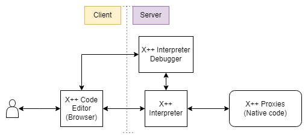
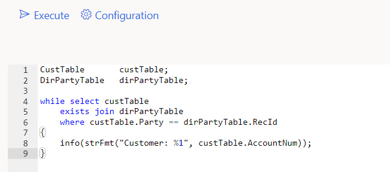
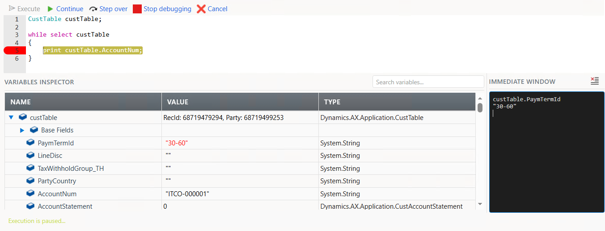
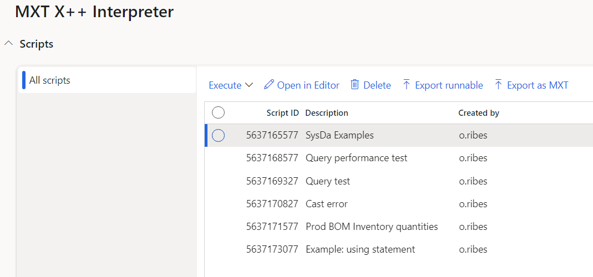

<h1 align="center">MXT - X++ Interpreter (preview)</h1>

 > **_IMPORTANT:_** It is **not recommended** for Production scenarios as this tool allows you to execute code without guarantee.

This tool allows you to write, execute and debug X++ code directly in the browser, without the need to compile or wait for service restart.

## Getting started
1. Clone the repo
2. Execute `Initialize.ps1` script as *Administrator*. This will create a symbolic link into your *LocalPackageDirectory*
3. Build and synchronize the **MXppTools** model
4. Navigate to System Administration > Workspaces > **MXT - X++ Interpreter**

# Interpreter
This tool generates bytecode that is later interpreted directly during execution. The instructions that are interpreted are executed in native code using a series of proxies written in X++. That allows to simulate the execution *almost* exactly as native code would do it, without the need to compile.

### Code editor
The editor will highlight the reserved words and will indicate you which statement is being executed when debugging. It will also tell you if your code has any syntax error.

Some keyboard shortcuts are implemented to easily execute, insert a breakpoint, step over and continue debugging. These can be found as standard shortcuts by Right click > View shortcuts on the editor.

The variable inspector will allow you to take a look to the variables that are currently on scope and will let you modify the values for primitive types.

### Script repository
You can save X++ scripts into the built-in repository to later execute them.

# Use cases
* Execute, modify and save X++ scripts
* Experiment with unknown or new functionality
* Test pieces of your code
* Get metadata information quickly (class and table ids, label texts, enum values...)

## Security
For development environments no additional security is needed, but if you run the script on a non-development system a user should have **MXT Script executor** role.

## Limitations
* **Macros** usage and declarations are not supported
* **Class declarations** are not supported
* **.NET namespaces** cannot be referenced
